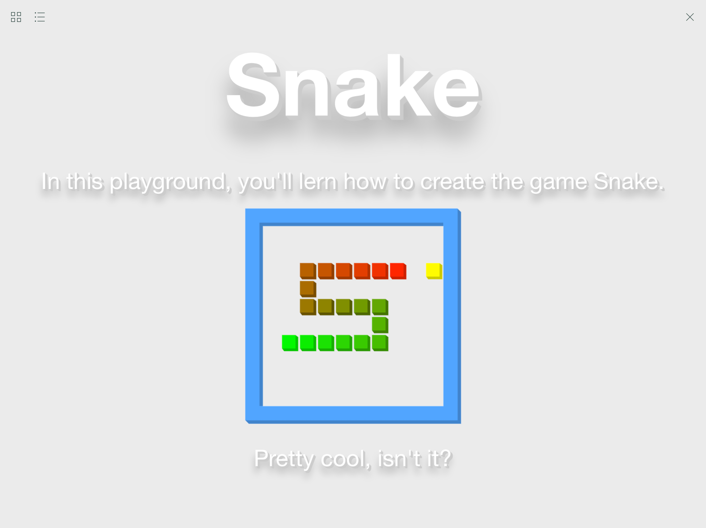
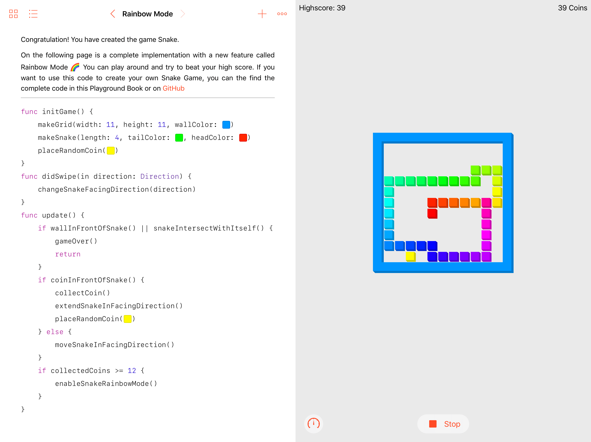

# Snake Playgroundbook
My Playground Book for iPad is a tutorial on programming the famous arcade game „Snake“, using UIKit/CoreGraphics for drawings and layout, addressing intermediate users.

This is my submission to Apple for a Scholarship to receive a WWDC 2017 ticket.

### [Overview Video](https://youtu.be/fs60kMa0Of4)

All graphics were initially created in PaintCode wich enables dynamic parameterized graphics drawing at runtime, keeps the final book size at minimum and allows the user to change the appearance of any game object individually and thus create their own version of „Snake“. 

Apart from this, my Playground book features simple functions only, so that the intermediate user may not be overwhelmed. Every Playground page is equipped with useful hints for when the user calls functions in a wrong order: e.g. “Try to create a snake with `makeSnake(length: Int, tailColor: .green, headColor: .red)` after you created a grid”

For the main features of the game, swipe gestures are used for controlling the main direction of the snake. It’s visual appearance consists in a number of individual blocks that change color as the snake grows longer. The color is computed by a linear interpolation from the user defined tail color to the head color. As reward for collecting 12 coins the Snakes color changes from this linear RGB interpolation to a linear HSL interpolation which provides a nice Rainbow effect.
To bring all down to a round figure, I used AVFoundation to add nice little sound effects. Every action of the game has an individual sound effect. For example „applause“ for a completed task  👏. Some of the sounds, I even created myself, i.e. the snakes moving sound was recorded with the microphone of my MacBook. 

To meet the „maximum 3 minutes“ requirement, I had to remove two Playground Pages from the book. However, You may enable them by adding ’02_Challenge.playgroundpage’ and ’03_Challenge.playgroundpage’ to the documents manifest. 
I asked some classmates, who never wrote swift code before, to test my Playground Book, and for completion, they needed only little more than 3 minutes.
Considering, people at Apple have more experience with Swift, my Playground Book should meet Your requirements. 😄